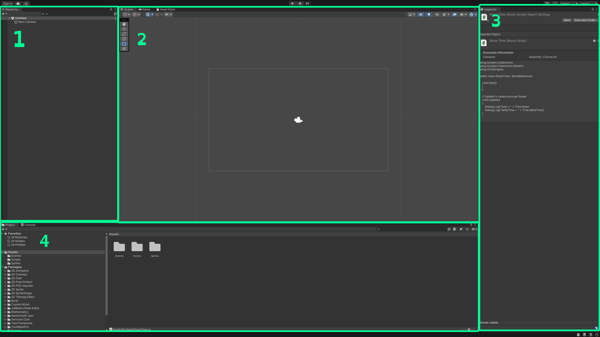
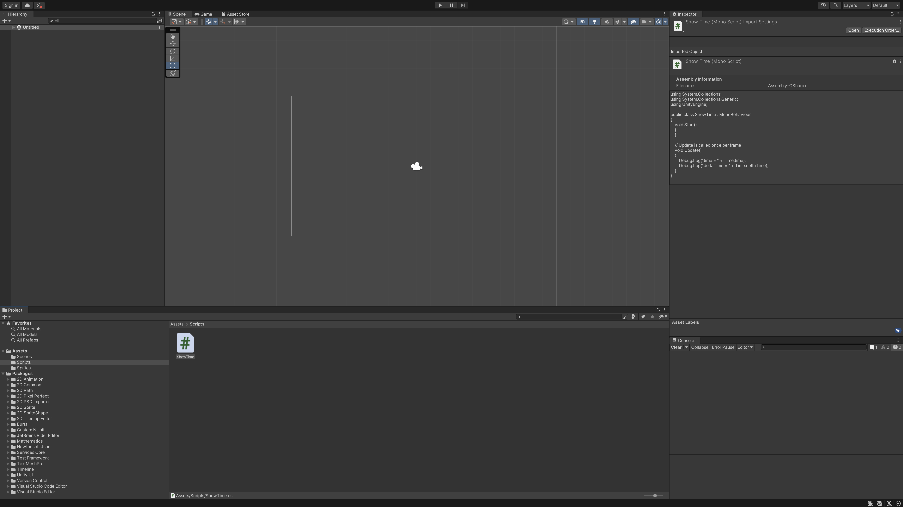
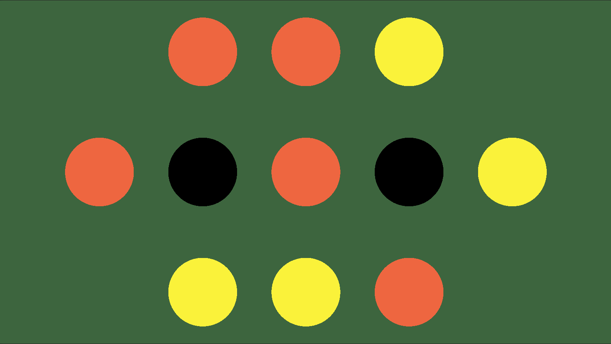
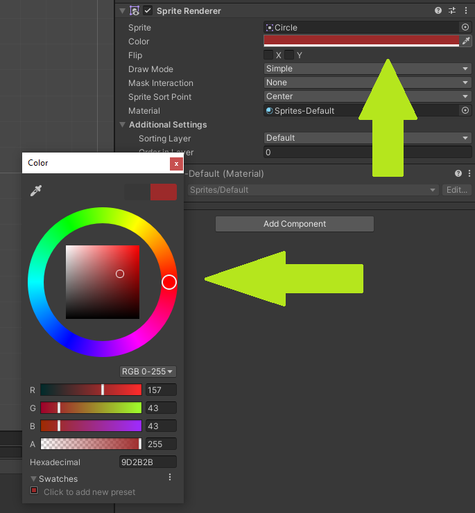
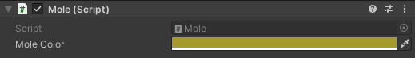

# COMP2160 Prac 01: Whack-A-Mole

## Topics covered:
- Discussion: Your values as a game developer
- Event-based programming
- Time
- Components

## Discussion: Your values as a game developer
Fresh out of University, you and a group of other graduates decide to make a game together in the hopes of adding to your portfolios and getting some more experience. At your first meeting together, you start discussing what values you all want to uphold when working together, and what they mean for you all individually. You recall the [ACS Code of Professional Ethics](https://www.acs.org.au/content/dam/acs/rules-and-regulations/CodeOfProfessionalEthics_Mar_2023.pdf) and the values of honesty, trustworthiness and respect for both the individual and the profession. How do you articulate what these values mean to you, and how you will uphold them as a game developer?

## Welcome and Github/Unity refresher
In these sheets, you'll find the exercises you must complete each week to earn a mark. Every week includes a task that you can complete to earn half a mark, followed by a more complicated, "Create" task to earn the full-mark. If at any point you get stuck, don't forget to read the read the [Unity Scripting Reference](https://docs.unity3d.com/ScriptReference/). To complete the Create tasks each week, you'll be expected to read through this documentation and problem solve. These tasks will serve the basis of your GDT1 and GDT2 tasks, so remember to always ask your tutor if you get stuck.

### Linking your Student ID
If you've made it this far, you've already used the Github Classroom link on iLearn. But did you remember to link your Student ID to your Github account by selecting your student ID from the list? If not, you'll need to make sure you do that next time, as this information is used for marking your assignments.

If your student ID wasn't on the list, please send an email to cameron.edmond@mq.edu.au with your student ID so it can be added to the roster. You'll be able to link your account next prac.

### Opening the project
Clone the repository onto your computer using the Git client of your choice. We are using Github Desktop. However, you are free to use whatever Git client you'd like.

#### Brushing up on Git
We will not go into detail about cloning projects using Github, as you will have covered this previously. If you need a refresher, we've provided Github's short course on [Git and Github Fundamentals](https://classroom.github.com/a/0WJTTJD6).

#### Opening Unity Projects
Remember that this unit's Unity projects are contained **inside** the repository, rather than repository itself. Open this up in Unity, making sure you are using [2021.3.17f1 (LTS)](https://unity.com/releases/editor/whats-new/2021.3.17).

Let's review the Unity interface. This unit is really focused on more intermediate game development techniques, so it's a good idea to take the time today to remind yourself of the basics. Here is an image of the default Unity layout:



1. The heirarchy, which displays all objects in the loaded scene. Use this to select objects in your scene, rename objects, etc.
2. The scene view, which displays the loaded scene spatially, and can be used to select, reconfigure and otherwise modify the scene. The Game and Asset Store views can also be accessed here using the tabs along the top of the window.
3. The inspector, which displays the current information of the selected object or asset. In this case, the script "ShowTime" is selected, so a preview of the code can be seen. The inspector is where you can monitor an object's parameters, or add and edit components.
4. The project panel, which shows the file contents of your project (predominently the assets and packages). The console window can be selected here using the tabs along the top of the window.

As a developer, it's a good idea to monitor the console window, so you can keep track of any debug statements or errors that pop up. To move a particular window, click-and-drag on it's name and release when you are happy. I like to keep my console log under my Inspector window:



## Today's task
Once you've reaquainted yourself with Unity, it's time to start doing some Game Dev! In this prac, you will implement a simple Whack-A-Mole game:




Your objective is to create a game where the screen shows a collection of mole holes (black circles). At random times, these  circles  will turn yellow to indicate a mole has popped out. Clicking on the yellow circles will "Whack" them, causing the mole to drop back down and the circle to turn black. If the player leaves a yellow circle for too long, it will turn red and be unclickable, then turn to black after a few seconds.

You can play a completed version of the [game here](https://uncanny-machines.itch.io/comp2160-week-1-prac).

## Step 1 - ShowTime

Open the ShowTime script in the Scripts folder. It uses the ```Debug.Log``` function to show the value of Time.time on every update. What do you expect to see when this script is run?

Create an Empty GameObject by selecting GameObject > Create Empty from the menu bar, or by pressing <b>CTRL/CMD + SHIFT + N</b>. This will create an Empty GameObject in your Heirarchy. Through the insepctor, add the ShowTime script to it (Add Component > Scripts > ShowTime).

Run the game. Look at the output in the console. Does it match your expectations?

Now, replace this code with:

```
Debug.Log("deltaTime = " + Time.deltaTime);
```

```Time.deltaTime``` returns the interval between the current frame and the last, whereas ```Time.time``` returns the time between the start of the frame and the start of the application. Time.deltaTime is a useful tool when making our games framerate indepedent, so that they run consistently across different devices. 

You can learn more about Time.deltaTime by reading through the [Unity API Documentation](https://docs.unity3d.com/ScriptReference/Time-deltaTime.html). Throughout these exercises we will be linking to Unity's documentation for details about different classes and methods used. We will not be explaining what everything does. It is up to you to get used to reading the API reference yourself.

Calculate how many frames per second your game is running at (hint: fps = 1 / deltaTime). This should change depending on various factors including: the speed of your computer, whether it is running on battery or mains, what other programs are running, etc. Experiment to see what you can do to change it.

### Checkpoint: Commit your work!
Save, commit, and push your work now. Can't remember how to do these steps? Ask your tutor! Regularly saving your work is an important habit to get into, and will save you a lot of grief later.

## Step 2 – Changing a sprite’s color

### Empty Game Objects
Let's start by creating our Mole object. First, create a new Empty GameObject like before. Make sure to give it a meaningful name, such as "Mole". You may also want to delete your previous Game Object just to keep your heirarchy and scene tidy.

Take a look at the Mole in the Inspector. It's only has a few paramters: a name, a Static boolean, a Tag and a Layer. Along with the Transform component, these are the basic, fundamental elements of a GameObject in Unity. This is similar in other game engines you'll encounter, but names and nuances will vary.

### Working in the Inspector
To represent our Mole on screen, we're going to add a ```SpriteRenderer``` component. You will be familiar with components from COMP1150. However, a big difference in this unit is that we are going to be writing our own code to manipulate these components, rather than just setting values in the Inspector.

In the Assets > Sprites folder you'll see a single sprite: Circle. We're going to add this to our Mole object. In the Inspector of the Mole object, press Add Component > Sprite Renderer. The first field of this new component is Sprite. Drag-and-drop the Circle sprite from the Assets folder into this field now.

The circle sprite is white, which makes it a good candidate for manipulating its ```Color``` value, which, as you would have guessed, dictates the colour of the sprite. You can adjust the Color filed in the SpriteRenderer component directly by clicking on the colour to bring up a colour wheel. Go ahead and give it a go now. Don't forget to change the Alpha channel (the fouth number) to 255 so we get a nice, solid colour:



### Modifying values with code

In code, this is the ```SpriteRenderer.color``` property. It takes a value of type Color. Note that the Color class defines common colours as named constants (Color.red, Color.blue etc).

We're now going to try our hand at modifying values using code. Create a new script called Mole (Assets > Create > C# Script). Double-click the script to open it for editing. Note that, as covered in the lecture for this week, it is a ```MonoBehavior```. You can read more about MonoBehaviours [here](https://docs.unity3d.com/ScriptReference/MonoBehaviour). 

To change the sprite colour, we need to get a reference to the sprite’s renderer. Add the following code to the Start method:

```
[RequireComponent(typeof(SpriteRenderer))]
public class Mole : MonoBehaviour
{
    private SpriteRenderer sprite;

    void Start()
    {
        sprite = GetComponent<SpriteRenderer>();        
    }
}
```

The ```RequireComponent``` line tells Unity that your script expects the object to have a SpriteRenderer component. It will give a warning if you try to add this script to an object without one. This isn’t strictly necessary, but is good practice and helps you avoid mistakes.

Through ```private SpriteRenderer sprite``` we are declaring a SpriteRenderer variable that we can access throughout any methods in our code. Sometimes we only want to declare variables when we are about to use them, such as inside methods. However, we know we will be using this Sprite Renderer a lot in our code, so we can go ahead and set it up the right way now.

The ```GetComponent``` method looks on the object for a component of type SpriteRenderer and returns a reference to it. This method is rather slow, so if you need to access a component often (e.g. every call to Update) you want to call ```GetComponent``` once and store the value in a private field, as we've done here.

Now that you have access to the component, you can change the colour by assigning a new value to its Color property. Add the following code in the Start method: 

```
sprite.color = Color.green;
```
Now, hit play - your Mole should now be a bright green! Try setting this to another colour - can you make the Mole red? Pink? Brown?

### Checkpoint! Save, commit, and push your work now.

## Step 3 – Serializing fields
Often, we want to be able to make certain properties of our MonoBehaviours accessible in the Inspector. By serializing our variable, we can make it editable in the Inspector.

Create a Color variable for your Mole by adding the following code before the Start method:

```
[SerializeField] private Color moleColor;
```

Now assign this colour to the Mole's SpriteRenderer by modifying the Start method:

```
void Start()
{
    sprite = GetComponent<SpriteRenderer>(); 
    sprite.color = moleColor;
}
```

Select the Mole in your heirarchy. In the Inspector, you should see something like this:



Changing the moleColor paramater will change the value of the color field on your script, which will in turn set the SpriteRender's colour.

Check this works by changing moleColor to a colour of your choice and hitting Play. Now, try changing the colour while the game is running. What happens? Why?

### Checkpoint! Save, commit, and push your work now.

## Step 4 – Handling Mouse click events
Time to turn this into a game! We're going to make the sprite change colour when the player clicks on it.

First, add a new field to contain the colour to change to. Remember to give it a meaningful name:

```
[SerializeField] private Color clickColor;
```

To make our Mole react to being clicked on, we can use Unity's built in ```OnMouseDown``` event. You can read the [documentation here](https://docs.unity3d.com/ScriptReference/MonoBehaviour.OnMouseDown). 

Add this to your code, making sure you copy the method signature (name, return type and paramters) from the manual exactly, or else Unity won't know where to find your method:

```
void OnMouseDown()
{

}
```
As the OnMouseDown documentation says, an object needs to have a ```Collider``` component in order to register mouse click events. Add a ```Circle Collider 2D``` to the Mole Game Object now.

Now, let's finish our code. Inside the OnMouseDown method, we need to add code to make the Mole's colour change to our new clickColor. Using what you've learnt so far, give it a try.

### Checkpoint! Save, commit, and push your work now.

## Step 5 – Adding a timer
We will now make the sprite change back to the starting colour after a period of time. As a game developer, your main job is finding ways to solve problems like this. You might want to take a second to think about how you would solve this problem first, then read on for the solution.

### Necessary steps
To solve this problem, we can consider a few necessary changes to our code:

* We need to declare an editable field to set the time delay in seconds before the sprite changes back to the old color:

    ```
    [SerializeField] private float timeDelay;
    ```

* We need a private timer variable to countdown until the color change:

    ```
    private float timer;
    ```

* We need to add to our OnMouseDown method so that the timer is set equal to the timeDelay when the player clicks on the Mole:

    ```
    timer = timeDelay;
    ```

* In our Update method, we need to reduce the timer by ```Time.deltaTime``` at the beginning of each frame. Once the timer hits zero, we need to change the colour back to the starting colour:

    ```
    void Update()
    {
        if (timer > 0)
        {
            timer -= Time.deltaTime;
        }
        if (timer <= 0)
        {
            sprite.color = moleColor;
        }
    }
    ```

## Half mark complete! Save, commit and push your work now.

### To receive half marks for today, show your tutor:

* Your mole.cs MonoBehaviour, both in code and the Inspector, with appropriately named variables.
* Your working Mole-clicking.
* Your updated Github Repo (did you remember to link your Student ID?)

## Create: Finish the game
This week, your challenge is to add the rest of the code necessary to finish the game:

* Create 3 colours, representing the states ‘down’, ‘up’ and ‘missed’ (Hint: you've already made two of these).
* The mole starts in the ‘down’ state. After a random amount of time it changes to the ‘up’ state. You can use the method ```Random.Range()``` to generate a random float between a min and max value. Check out the [documentation here](https://docs.unity3d.com/ScriptReference/Random.Range.html).
* Set up some parameters to allow you to tune the minimum and maximum times.
* The mole stays in the ‘up’ state for a fixed period of time. When the timer runs out, it changes to the ‘missed’ state.
* If the mole is clicked while it is in the ‘up’ state, it immediately changes to the ‘down’ state.
* The mole stays in the ‘missed’ state for a fixed period of time. When the timer runs out, it changes to the ‘down’ state.
* When the mole goes into the 'down' state, the random timer starts again.

### Finishing up
Test this with one sprite and make sure all the transitions work as expected. Then, duplicate the mole object and lay them all out to complete the game. Tune the parameters in the Inspector until the game provides an interesting challenge. You also might want to change the background colour of your scene by altering the camera's clear colour, and change the Game window from Free Aspect to a sensible Aspect Ratio (16:9 or 16:10 is standard for computers and consoles, while 9:16 is typical for smartphones).

You should also rename some of your variables to more meaningfully reflect these changes (i.e., "moleColor" doesn't make a lot of sense anymore - what should this be called?)

### Debugging tips
If things aren’t working:
* Keep an eye on the console to see if there are any errors in your code, either at compile time or at runtime. If any error occurs, the console will direct you to the line of the script but remember that the actual problem may have happened earlier.
* Use the ‘step’ function to play your game frame-by-frame and see what is happening.
* Use the ‘Debug’ mode in the Inspector to watch the private state variables change.
* Use the ‘Debug.Log” method to print messages to the console to help work out what is going on. E.g. it could be helpful to print something at the beginning of OnMouseDown to log whenever a sprite is clicked, to make sure the events are being caught properly.

## Prac Complete! Save, commit, and push your work now.

### To receive full marks, show your tutor:
* Your finished game, and how you solved the problems.
* Any tweaks you made to your code once you finished.
