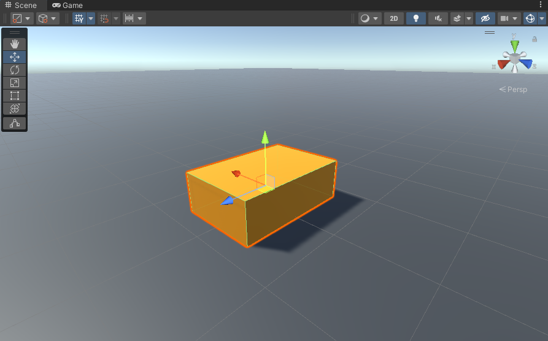
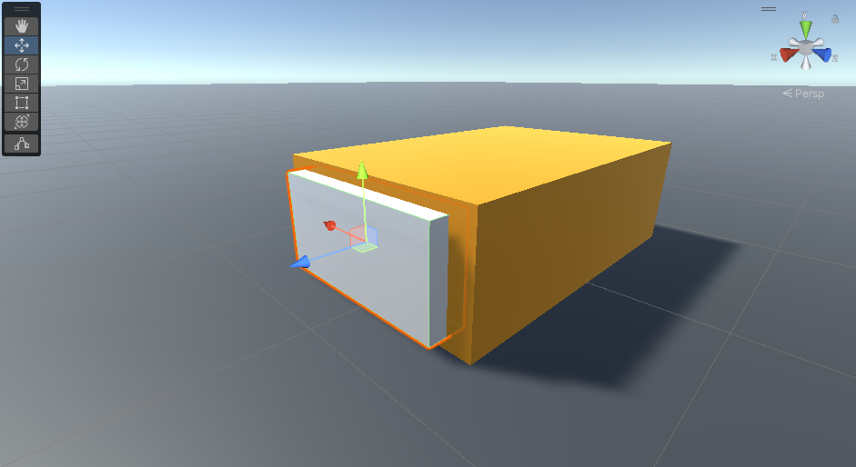
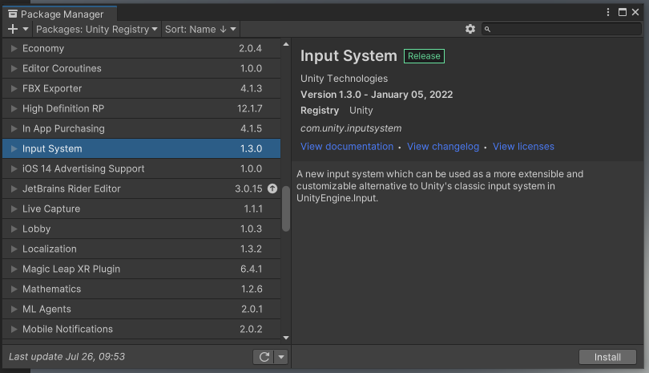
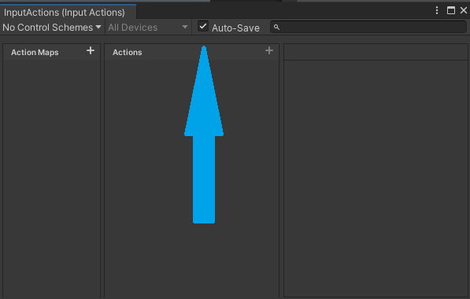
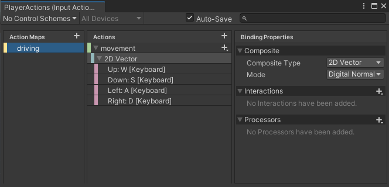

# COMP2160 Prac 02: Car Chase
  
## Topics covered: 
* Vectors 
* Coordinate spaces
* Moving with Transform 
* Input

## Discussion:
You are working on a large project for your studio. Your team leader has pretty much left you all to your own devices to work on things, <b>trusting</b> you all to get your work done. While things have been going smoothly, you soon notice a programmer colleague of yours is beginning to get overworked. As a result, you’ve noticed them cutting corners and missing milestones.

A major deadline for the project is coming up. If you’re being <b>honest</b>, you’re not confident your colleague can make it without either burning out, or turning in un-finished work, which would be a bit <b>disrespectful</b> to the rest of the team. You are not in any sort of management position, and the rest of the team seem to be unaware of the issue. What should you do? Refer back to the ACS code of professional ethics for how to navigate the situation.

## Today's Task
In this prac you will implement a car-chase game: 
https://uncanny-machines.itch.io/comp2160-week-2-prac
 
The player controls the orange car with the following controls:

<b>Keyboard</b><br>
Movement: WASD or Arrow Keys<br>
Turbo Boost: SpaceBar

<b>GamePad</b><br>
Accelerate: West Button ("X" on XBox Controller)<br>
Reverse: South Button ("A" on XBox Controller)<br>
Turn: Left Stick<br>
Turbo Boost: Right-Bumper

The blue car chases the orange car. The blue car slows to a stop when it gets close to the orange car.

The two main pieces of documentation for today are [The Transform class](https://docs.unity3d.com/2023.1/Documentation/ScriptReference/Transform.html) and [The new Input System and the Action Asset workflow](https://docs.unity3d.com/Packages/com.unity.inputsystem@1.6/manual/Workflow-ActionsAsset.html). Refer back to these pages whenever you get stuck.

## Step 1 – Get moving
Open the SampleScene in the Scenes folder. It contains a single orange car (a rectangular block).

Click on the car with the Move tool in the Scene view and notice how its <b>local coordinate space</b> is aligned. Make sure you have the tool handle view set to Pivot and Local, using the tools at the top left of the Scene window. Your view should look something like this:



Note the difference between the car's coordinate space and the <b>world coordinate space</b>, represented by the widget in the top right of the Scene view.

Create a script called Drive that moves the car forwards at a constant velocity using ```transform.Translate()```. You'll need to figure out which direction is "forwards" first. Taking a look at the coordinate systems, we can see that the car's "forward" direction appears to be going along its Z-axis (the blue arrow). We can therefore define a "forward" Vector3, as well as a movement speed, by adding the following:

```
[SerializeField] private float speed;
private Vector3 direction = new Vector3(0,0,1);
```
We will then need to add some code to our ```Update``` method to move our car (don't forget to set your speed in the Inspector):

```
transform.Translate(direction * speed * Time.deltaTime);
```

If you hit play now (after attaching the script to the car), the car should move forward in its own coordinate space. By default, Unity will apply this translation to an object's local space. However, you can specify the coordinate space. Try experimenting by replacing your translation with these lines of code one-by-one, each time hitting play and seeing what happens:

```transform.Translate(direction * speed * Time.deltaTime, Space.Self); //Uses local coordinate space```<br>
```transform.Translate(direction * speed * Time.deltaTime, Space.World); //Uses world coordinate space```<br>
```transform.Translate(direction * speed * Time.deltaTime, Camera.main.transform); //Uses main camera's coordinate space.```

NOTE: The main camera's transform was used in this example as every object has access to a scene's main camera by default. You can pass other coordinate spaces into here.

Although we wrote our own Vector3 for storing the direction, in this case we don't need to. Unity offers a number of [built-in Vector3 directions](https://docs.unity3d.com/2023.1/Documentation/ScriptReference/Vector3.html) to provide shorthand for writing basic directions. Let's remove our ```direction``` variable and change our code to:

```
transform.Translate(Vector3.forward * speed * Time.deltaTime, Space.Self);
```

### CHECKPOINT! Save, commit and push your work now

## Step 2 – Going in circles

Add code to make your car turn at a constant rate, using ```transform.Rotate()```. First, specifiy a turning rate parameter (in degrees):

```
[SerializeField] private float turningRate;
```

Remember to specify this in the inspector before running your game. Don't forget to check the [documentation for more info on Rotate()](https://docs.unity3d.com/2023.1/Documentation/ScriptReference/Transform.Rotate.html).

Figuring out which axis to rotate around can be a bit tricky. The way to think of this is we want to rotate around the axis that ISN'T changing. So, if an object is going to be pointing in different X and Z directions, then we want to apply the rotation on the Y axis. If we had to define this vector ourselves, it would be (0,1,0). However, we can again use Unity's built-in shorthand:

```
transform.Rotate(Vector3.up * turningRate * Time.deltaTime, Space.Self);
```
Experiment with different parameters for your Drive script. How do the speed and the turning rate affect the radius of the car's turning circle? What is the formula for this?

Consider which parameter is more designer-friendly: turning speed (in degrees per second) or turning-circle radius (in metres)? Why?

### Transform Hierarchy

Let's make it a bit easier to visualise our car's front. Create a new cube object, making it a child of the car and repositioning/resizing it so we get something like this, representative of headlights:



Press play, and observe the headlights object in both the Scene view and Inspector. Note how its position and rotation values don't change, despite its transformations within the scene. The Inspector shows an object's local transform, which is based on its parent's. When an object has no parent, then its "parent" is effectively the world.

### CHECKPOINT! Save, commit and push your work now.

## Step 3 - Chase car 
We often want objects in our scene to read and react to the transforms of other objects. Let's try this now.

Add another car to the scene and give it the provided blue material. Create a ```Chase``` script for this car. Add a parameter to the Chase MonoBehaviour to hold the transform of the target it is chasing. Make sure it is editable in the inspector:

```
public class Chase : MonoBehaviour 
{     
   [SerializeField] private Transform target;  
} 
``` 

### Basic chase behaviour
In the Inspector, drag the orange car into the target slot on the chase car. Notice how Unity automatically finds the Transform component of the car. In general, if a field has a particular component type (Transform, SpriteRenderer, etc) then Unity will allow you to drop an object in that slot as long as it has the appropriate component. 
 
In the Chase MonoBehaviour's Update method, calculate the distance between the car and the target as the magnitude of the vector from transform.position to target.position. Have a look at the [Unity Documentation for Vector3](https://docs.unity3d.com/ScriptReference/Vector3.html) and try to find a Static Method that you can use to get this value. 
  
If the car is more than some minimum distance (tunable parameter) from the target, it should move forwards in local coordinates. Otherwise, it should stop. Code this and test it. 
 
To make the car turn appropriately, we need to know whether the target is to the left or the right. We can do this by transforming the target’s position into the car’s local coordinate space.

Take a look at the following methods to determine which one you should use and why. If you're a bit stuck, have a look at the documentation for [TransformPoint](https://docs.unity3d.com/ScriptReference/Transform.TransformPoint.html) and [InverseTransformPoint](https://docs.unity3d.com/ScriptReference/Transform.InverseTransformPoint.html).


```transform.TransformPoint(target.position)```<br>
```transform.InverseTransformPoint(target.position)```<br>
```target.TransformPoint(transform.position)```<br>
```target.InverseTransformPoint(transform.position)```
 
Once we have the point in the right coordinate space, we can check whether it is on the left or right by examining its x position. Negative x is on the left, positive is on the right. Use this info to alter the direction the car is turning.

## Step 4 – Adding input
Let's add some interactivity by adding input to control the car's movement and turning. We'll need to add the New Unity Input System to our project and disable the old one to get started.

Import the new Input System by opening the Package Manger (Window > Package Manager). Set the Packages filter to "Unity Registry" in the top left of the new Window (so it should read "Packages: Unity Registry"). Locate the Input System and click "Install", then press <b>Yes</b> to enable the new Unity backends.



### Adding an Actions Asset
The new Input System is highly flexible, with many different approaches. We will be taking the approach we believe is most suitable for learning the ins-and-outs of building inputs.

Create a new Input Actions Asset (Assets > Create > Input Actions). Make sure to give it a meaningful name. I'm calling mine ```PlayerActions```. You'll also want to store it in a folder.

Select your Input Actions Asset to make it appear in the Inspector, then click "Edit asset" to start adding Inputs. <b> IMPORTANT! MAKE SURE YOU TICK THE "Auto-Save" box! </b>



Before we start adding Input, we need to consider what actions we want. We want the player to...

* Move the car forwards in local space by pressing a "forwards" button.
* Move the car backwards in local space by pressing a "backwards" button.
* Turn the car to the left in local space by pressing a "left" button.
* Turn the car to the right in local space by pressing a "right" button. 

Essentially, we will need both a Horizontal and Vertical axis input.

Each Input Actions Asset contains both <b>Action Maps</b> and <b>Actions</b>. Action Maps can be thought of as different collections of Actions, allowing for different key-bindings. E.g, you might have a different Action Map for a menu and one for driving, then actions for navigating the menu, moving the car, etc. 

In our case, we only need one Action Map. Press the + symbol next to "Action Maps" to create a new Action Map. Let's call it "driving".

We can then create Actions that are part of this Action Map. Click the + next to "Actions" and name this first Action "movement". In the "Action Properties" column, we want to tell Unity how to interpret the input leading to this Action. The default Action Type is a "Value", which essentially tracks changes to a Control state continuously, so is useful for things like movement.

We need to set what Control Type we want to send to the Action Type. This is the data type used. In our case, we want to set this to "Vector 2", as we will be reading both X and Y values to determine the car's transformations.

The next step is to tell the Input System which inputs to read from for this particular Action. Press the small + next to the drive action and select "Add Up\Down\Left\Right Composite". This will create a 2D Vector for this binding, where you can populate each direction with its own button.

For each of these directions, we need to add a binding. For today, let's set this to either the Arrow Keys or the WASD controls, whichever you prefer. To do this, select one of these directions and press the drop-down next to "Path". You can either search for what you want, or press "Listen", followed by the desired key.

Your Input Action Asset should looks something like this:



We can convert our Input Actions Asset into a C# Class, which we can then use in our scripts. In the Inspector, tick the "Generate C# Class" box now, then hit "Apply". The name you set for your asset is now the class name. As mine was called PlayerActions, this is what the examples will demonstrate.

We'll be making additional changes to our Actions as we go. With "auto-save" and  "Generate C# Class" both ticked, these changes will be written to the script as we go.

### CHECKPOINT! Save, commit and push your work now.

We now have our inputs all sorted out, but still need to tell our car how to react to them.

We want to give our Drive script its own copy of the PlayerActions class we've created. We also want to retrieve the actual movement action.

```
using System.Collections;
using System.Collections.Generic;
using UnityEngine;
using UnityEngine.InputSystem;

public class Drive : MonoBehaviour
{
    [SerializeField] private float speed;
    [SerializeField] private float turningRate;

    private PlayerActions actions;
    private InputAction movementAction;
```

We then need to initiate things. We need to do this in the Awake() method, which runs before the Start() method (This order is detailed in the [execution of Unity methods documentation](https://docs.unity3d.com/Manual/ExecutionOrder.html)).

```
void Awake()
{
    actions = new PlayerActions();
    movementAction = actions.driving.movement;
}
```

The last thing to do is enable the actions we want to use. Actions can be enabled individually, or we can enable an entire ActionMap at once. We will be enabling Actions individually to have greater control of when they are turned on and off. We want to do this in the ```OnEnable()``` method, which is called between ```Awake()``` and ```Start()```:

```
void OnEnable()
{
    movementAction.Enable();
}
```

As best practice, we should also Disable our Actions to prevent actions from being called in the event of the player being destroyed or otherwise disabled. The method ```OnDisable()``` is useful for this, as it runs just before an object is destroyed, and is traditionally used for any clean-up code.

```
void OnDisable()
{
    movementAction.Disable();
}
```

### Reading input: polling versus event-driven
We now need to decide how we are going to read the Input in this script, and what we are going to do with it. As discussed in the lecture, there are two ways to think about this problem: polling and event-driven. We'll be exploring both in this task.

We're going to use polling to control our car's movement and rotation. In our Update method, we want to read the input every frame and write it to a value. Because we have defined this input as a Vector2, we know that whatever keys we bound to "up" and "down" will be read as the positive and negative of that Vector's y axis. In update, add the following code:

```
float acceleration = movementAction.ReadValue<Vector2>().y;
```
This will store the y value between -1 ("Down") and 1 ("Up"). We can then add this to our Translation equation:
```
transform.Translate(Vector3.forward * speed * acceleration * Time.deltaTime, Space.Self);
```

Save your script, hit play and test the car's movement behaviour. You might want to turn your turningRate to 0 first to give yourself some more control.

Once your car is moving, your next task is to repeat this process using the x value of your input to control the car's rotation.

Something you will notice is that the car's movement isn't very natural at this stage, as it can turn on the spot. In order to fix this, we want the car's acceleration to factor into its turning. Following the patterns you've done so far, give this a try. Ask your tutor if you need any tips.

## Step 5 - Modulating speed
We're now going to give our car a "turbo" boost option, which allows the player to increase their speed for a short period of time. We'll use an event-driven approach to get this value.

Open your Input Action Asset again and add a new Action to the ActionMap. Name it "turbo". This time, we want the Action Type to be set to "Button", as we want to receive whether it is pressed or not. For more info on the difference between these types, [see the documentation](https://docs.unity3d.com/Packages/com.unity.inputsystem@1.0/manual/Actions.html#action-types).

The default binding only takes a single button/key. This will do fine for our purposes, so simply set the path of the Binding to a button of your choice - I'd recommend the SpaceBar.

In the Drive script, add an InputAction for the turbo and set-it up the same way you did movement in the ```Awake()``` and ```OnEnable()``` methods.

Rather than polling to handle our turbo, we will be using an event-driven approach, where we assign a method we want to call every time the turbo button is pressed to our turbo button delegate. See the lecture notes if you want to brush-up on delegates and how they operate.

Firstly, we should set-up some values. There's a few ways to handle a boost speed: we could either store a "normal" speed and a "boost" speed, and modify the car's movement speed depending on what mode they are in. Or, we could treat boost as a multiplier, integrating it into our existing calculation. I am going to demonstrate the later, but the former approach is fine too. 

To apply our boost to our movement, we'll need two new variables: a private ```boost``` variable which we'll factor into our movement calculation, and a tunable ```boostRate``` that we can modify in the inspector. Following the same patterns we've done so far, add this into your code. Should the boost be multipled into our movement, or added? What is the difference, and how might this impact gameplay?

Next, we should set-up the method that we want to call. ```OnTurbo``` seems like a good name:

```
void OnTurbo(InputAction.CallbackContext context)
{
    boost = boostRate;
}
```

We now need to assign it to our delegate so it is called whenever the turbo button is pressed. Each input action has three different callbacks: started, performed and canceled. In our case, we want to use performed, so we will assign this in the Awake method:

```
turboAction.performed += OnTurbo;
```

If you play the game now, pressing the boost button should make the player's car speed-up, but it never slows back down! Add another method, such as ```EndTurbo(InputAction.CallbackContext context)```, and assign it to your turbo action's ```canceled``` Callback. Use this method to turn off the turbo feature, so the boost will turn on when the player presses the button, and off when they release.

### CHECKPOINT! Save, commit and push your work now.

### To receive half marks, show your tutor:
* Your movement and rotation controls, using polling.
* Your turbo on and off controls, using events.
* Your chase car, and how it works out where the target is.
* You will be evaluated on your code clarity, so make sure to clean it up before calling your tutor over.

## Create: Working with multiple interfaces
We have XBox Series Controllers in our lab! If your tutor hasn't already handed them out, you can now ask them for one. We're going to add gamepad support for our movement.

Plug the controller into your PC using the provided USB cable. Please remember to pack this away when you are done with it.

First, let's try mapping our movement to the Left Stick. You can add an additional binding to an action by pressing the + sign next to it. Do this for both your movement (Left Stick) and your boost (one of the shoulder buttons).

### Problems with input
You should notice that by mapping our movement to the Left Stick, we're now not able to turn at our full speed. The Left Stick is sending a Vector2 value that sits on a circle - by pushing in a diagonal direction, neither the x or y values will reach 1, but instead hover around 0.7 or -0.7.

Your challenge is to solve this problem. To do so, think to some of the racing games you've played and how they handle driving input. How could you break up your movement and turning effectively? Don't be afraid to refactor your driving controls!

### Better movement
Currently, the chase car starts and stops rather abruptly. Solve the following problems:

* How can you make the chase car slow down smoothly as it approaches the target, then stop at the minimum distance?
* How can you ensure the chase car doesn't turn when it isn't moving?
* Can you refactor any of your code to better leverage built-in variables (hint: do you still need to calculate the magnitude yourself?)

The boost being usable anytime the player wants isn't very interesting. Using the same patterns we covered last week, add a cooldown time where the player is unable to boost.

### Better visuals
There's a few things we can do to get our game looking a bit better. Try the following:

* Add a [TrailRenderer](https://docs.unity3d.com/2023.1/Documentation/Manual/class-TrailRenderer.html) component to your cars <b>(Add Component > Effects > TrailRenderer)</b>. Don't forget to add materials.

* You could also consider modifying other aspects of the cars to add lights or other features, but don't spend too long on this.

## Prac Complete! Save, commit and push your work now.

### To receive full marks, show your tutor:

* Your gamepad controls, and how you solved the problem of different inputs.
* Your code for making the chase car slow down smoothly when approaching the target.
* Any visual changes you made to your game.
