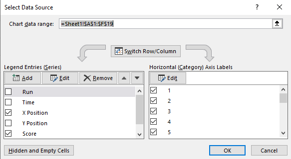

# COMP2160 Game Development – Prac Week 7

## Topics covered:
* User Data
* Data Management Plan
* Data Privacy

## Discussion: Data Privacy
The results from your large-scale playtesting (see last week’s scenario) are in! Excited with the results, your CEO has ordered your community manager to start promoting the data and findings at various conferences and on gamedeveloper.com. Your data analyst, who has just returned from vacation, has discovered a few concerning facts. For one, the third-party company used to collect this data has very little online about their own privacy policies or data collection procedures. Secondly, there is nothing in your game’s own privacy policy about this data collection. Finally, a handful of (hard-to-find) patterns can be pieced together using quasi-identifiers from the dataset to infer sensitive info.

As far as you and your team can tell, no one has put these identifiers together yet, but the data is out there. Relating back to the ACS Code of Ethics, and the GDPR and Privacy Act 1988, what should you do?


## Today's Task
In this prac you will be adding analytics for playtesting an arcade game. This is the same game as
week 6, with some of the bugs fixed!

The Unity project implements the entire game for you and includes an ERD to document the architecture. Your job is to add analytics to answer the following questions related to the game's difficulty:

* How hard is the game in terms of avoiding death? What is the main cause of player death, and when and where does this happen?

* How hard is the game in terms of defeating enemies? How does the player's score advance throughout the game, and are any sections (between checkpoints) easier or harder than others?

## Step 1 – Deciding on the data
The first step is to familiarise yourself with the existing code, and add some code to track the data.

Read the code and answer the following:
* Where does player death get processed? How do you know what caused the death?
* Where does player scoring get processed? How could you record the number of missiles, radar, and power cells destroyed?
* Where are checkpoints processed?

### Data Management Plan
Inside the Documentation folder, you'll find a Data Management Plan (DMP) template. Fill out Section 1 (Overview) based on the two questions we are answering and what you've uncovered from reading the code.

## Step 2 - Retrieving data
Add code to track the relevant information and display it in the console using Debug.Log().

#### Death
Print out:
* The time (since start of the game)
* The (X,Y) position of the ship
* The cause of death when the player dies (hint: you can use [LayerMask.LayerToName()](https://docs.unity3d.com/ScriptReference/LayerMask.LayerToName.html) to retrieve a layer's name).

#### Score at Checkpoint
Print out:
* The checkpoint name
* Time
* Score
* Number of missiles, radar, and power cells destroyed at each checkpoint
* Number of missiles, radar, and power cells destroyed at the end of the game

Consider how to best decouple the analytics tracking from the rest of the game. As much as possible, you want to avoid having your analytics code spread throughout a lot of scripts. You should be able to track all the above information in the GameManager with minimal changes to other classes.

Return to your DMP and complete section 2 (Data Collection) to reflect the data you are collecting. We will be updating this section as we go, so just fill in what you can for now.

### Checkpoint! Save, commit and push your work now.

## To receive half marks for today, show your tutor:

* Your Data Management Plan with Sections 1 and 2 filled out.
* Your Debug.Log() output of the data.

## Step 3 – Collecting and Storing the data
You’ll notice a new script in the Scripts folder called LogFile. This script allows a GameObject to send information that will be outputted into a txt file we can then use in Excel.

You’ll notice the script is already attached to the GameManager object, with some paramaters added. In the inspector, you’ll see settings for:
* Name: The name of the output file, in this case it is set to “Player Stats”
* Name Format: How the name is formatted. In addition to the Name string, it will also append date and time info.
* Headers: An array of headers for our data output. Pay attention to the order of these, as this is the order we need to feed data to the LogFile.
  
Now, open up the GameManager script. You’ll notice some new code:

```
void Update()
{
    if (log != null)
    {
        // write the time and the players x and y positions to the file
        log.WriteLine(Time.time, player.transform.position.x, player.transform.position.y);
    }
}
```

This code writes data to our logfile every Update. The data it is sending is Time since the game has started running, as well as the player’s x position and y position.

The data being outputted here isn’t all the data that we want, and it might not even be calling when we want it. Think about:
* What data do we want to write from our GameManager to the Log?
* When do we want to call the log.WriteLine() function? Do we really want to call it every frame?

Update the Data Collection section of your DMP to reflect your answers to these questions.

### Modifying the code
Make the necessary changes to both the GameManager code and to the LogFile’s paramaters in the inspector (such as adding/changing headers), using what you've recorded in your DMP as a guide.

### Logging data
When you run the game in Unity, a logfile will be created in a new “Logs” folder. Once you’ve run the game and triggered your log.WriteLine function, find the folder.

On the Lab PCs: The folder will be in <b>This PC > .Documents.</b><br>
On your home PC: Most likely, the folder will be in <b>Username > Documents.</b><br>
On your home Mac: Most likely, the folder will be in your <b>user root directory.</b><br>
On your home Linux: I don’t know. If you’re using Linux I reckon you can handle this part yourself.

Your log file will have been saved as a .txt file, but you can easily put this data into Excel or another piece of spreadsheet software. Either copy-and-paste the contents of the file into an Excel sheet, or open it directly in Excel and follow the prompts to tell Excel how to ingest the data.

Repeat this process a few times to get familiar with collecting data.

Using what you've learnt, complete the Storing Data section of your DMP. Normally, this would be done ahead of time, but it isn't uncommon to update DMPs as projects evolve. If there are any updates you need to make to Sections 1 an 2 of your DMP, do so now.

## Step 4 – Analyse the data
Have a look through the data you have collected. Try to answer the following questions:

* What is the high score of the player? What enemy objects does a high scoring player target?
* When does the player tend to die? What causes it?
* How long is a typical play session?

You may wish to use visualisations to help your analysis and to also communicate your findings. See the [end section of this prac sheet](#optional-data-visualisation-101) for info on how to create visualisations in Excel.

Record your results, ready to show your tutor. You can think about other trends you observe in your data. You may want to go back and make further changes to your data collection as you discover more interesting trends.

Fill out the final section of your DMP on how you are going to use the data, reflecting what you've discovered and what you might do in the future. Double-check your DMP to ensure nothing needs an update.

## Prac Complete! Save, Commit and Push your work now

## To receive full marks for today, show your tutor:

* Your completed Data Management Plan
* Your data and observations

## Optional: Data Visualisation 101
It's often useful to visualise our data for analysis and communication. This is not compulsory for this prac, but highly recommended. Experiment with the following forms of visualisations and see what you discover:

### Scatter Plot
Scatter Plots are useful for grouping multiple data points together and identifying similarities. You can turn your data into a Scatter Plot in Excel by selecting your data (only headers and numeric data - this WILL NOT work if you've also got strings in your dataset), then pressing Insert and selecting Scatter from the Charts section, then selecting the one you want to insert. Your result might look like this (note: data is an example only):


One thing you'll notice is that because the data is in very different measurements, it can be a bit hard to see much from here (although we can identify the score increasing as the player progresses through the map horizontally, which is to be expected).

### Column Chart and Selecting Data
To try explore our data more, we might want to compare individual values. Try selecting your data and creating a Column Chart this time, then right clicking and selecting "Select Data" then removing the data you don't want to compare in this chart. You may wish to add an extra column to your dataset to add an identifier to each run (question: how could you record this in your log file?). 



### Heatmaps
While Excel doesn't allow us to create heatmaps from our data per-se, we can use conditional formatting and sorting of our data to try and identify other trends. Firstly, sort your data <b>(Sort & Filter > Custom Sort...)</b> by one of your values. Then, column by column, apply conditional formatting by selecting <b>Conditional Formating > Color Scales:</b>


Explore your data through whatever modes of analysis give you the most insight. You can experiment with more if you want. Once your done here, you can return to finish your [analysis of your data](#step-4-–-analyse-the-data).
