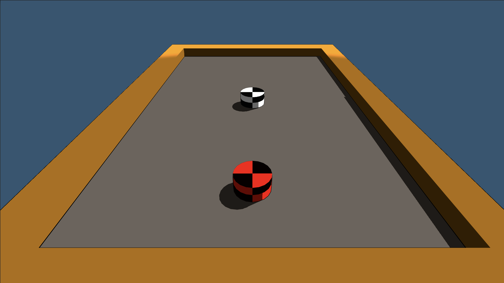

# COMP2160 Game Development – Prac Week 10

## Topics covered:
* Rigidbody Physics
* Collisions
* Audio

## Non-Discussion Question
There is no discussion question today. Instead, we'd like to give you some time to fill out the relevant Student Feedback Surveys for this unit. This will include a survey on the unit as a whole. If you are in Cameron's pracs, there will also be an open LET on his teaching. If you are in Kayson's pracs, you'll their LET will be opening in a couple of weeks - please fill these out too! You can access these surveys through your email, or by clicking on the link in the top right of iLearn on desktop, and the top block after your units on mobile. It looks something like  this:


Please take 10-15 minutes to fill these out. Your responses are very important to us, and are completely anonymous. We also do not receive the results until after grade finalisation. Open and honest results help us improve the unit.

## Today's Task
This practical is all about experimenting with physics in Unity to better understand how it works. More than ever, it is important you experiment, read the docs, and justify your decisions. And have fun!

You will be experimenting with physics in order to create an air-hockey game like this:


 
The framework implements the table, a puck (black and white) and a paddle (red and black). 
* The puck has a [rigidbody](https://docs.unity3d.com/ScriptReference/Rigidbody.html) component and is controlled by physics. Examine it in the inspector and make sure you understand what is going on.
* The paddle has a ```ControlPuck``` script that uses ray casting to convert the mouse position into a point on the table and moves the paddle to that position. Open the script and examine it to understand what is going on.

## Step 1 – Adding a Kinematic Rigidbody 
Play the game and note how the paddle moves and how it interacts with the walls and the puck. This current set up is invalid. The paddle has a collider but no rigidbody, i.e. it is a static collider. Static colliders should not be moved, as  Unity does not guarantee correct behaviour when you move a static collider. If we want to move an object using its transform, it should have a kinematic rigidbody.

Add the directive ```[RequireComponent(typeof(Rigidbody))]``` to the ControlPuck script so that it forces you to have a rigidbody on the paddle.

Rather than relying on the designer to make the rigidbody kinematic in the editor, we can do it directly in code. In the Start method set the isKinematic field on the rigidbody to true:

```
private Rigidbody rigidbody;
```
...
```
Start()
{
    rigidbody = GetComponent<Rigidbody>();
    rigidbody.isKinematic = true;
}
```

This is generally good practice: If your code expects a component to exist and be configured in a particular way, it is better to force this in code rather than rely on remembering to do it in the editor.

Play this version of the game. How does the kinematic rigidbody interact with static and dynamic objects in the scene?

### Checkpoint! Save, commit and push your work now


## Step 2 – Add Physics Materials & Constraints
At the moment, the puck moves with the default settings for friction and bounciness, which are not very suitable for the game.

Create separate [Physics Materials](https://docs.unity3d.com/2021.3/Documentation/Manual/class-PhysicMaterial.html) for the floor, walls, puck and paddle and attach them to the colliders for each. You may remember doing this in COMP1150.

Experiment with the settings until the puck moves smoothly with low friction and bounces off the walls in an appropriate way.

At the moment it is possible to make the puck bounce off the table. We probably don’t want this in the game. Add appropriate constraints to the puck’s rigidbody to keep it flat on the table.

### Checkpoint! Save, commit and push your work now

## Step 3 – Experiment with Paddle physics
We’re going to experiment with different ways of moving the paddle using rigidbody physics rather than transform. Rather than providing you with the solution for each, we will be giving you the links to documentation and asking you to implement solutions in each one. 

Don't worry if some of your results are a bit weird - this is about stepping outside of your comfort zone and experimenting. This is where you become a true game developer!

Disable the isKinematic flag on the paddle. 

Make five copies of the paddle control script. Rename their file and class names as follows, and implement the corresponding control schemes:

* <b>Position:</b> Move the paddle to the mouse position using [rigidbody.position](https://docs.unity3d.com/ScriptReference/Rigidbody-position.html).

* <b>MovePosition:</b> Move the paddle to the mouse position using [rigidbody.MovePosition()](https://docs.unity3d.com/ScriptReference/Rigidbody.MovePosition.html).

* <b>Velocity:</b> Move the paddle towards the mouse position at a fixed velocity using [rigidbody.velocity](https://docs.unity3d.com/ScriptReference/Rigidbody-velocity.html).

* <b>AddForce:</b> Add a force to accelerate the paddle towards the mouse position using [rigidbody.AddForce()](https://docs.unity3d.com/ScriptReference/Rigidbody.AddForce.html).

* <b>Impulse:</b> When the player clicks the mouse, add an impulse to move the paddle towards the mouse position using rigidbody.AddForce() with [ForceMode.Impulse](https://docs.unity3d.com/ScriptReference/ForceMode.Impulse.html). 

Play the game using each of these controllers. Can you explain the behaviour of each? Which is the most appropriate for this game and why?

Explore how the other parameters on the paddle’s rigidbody component (mass, drag, collision detection mode, etc) affect each version. Try and find your optimal puck movement.

## Checkpoint! Save, commit and push your work now

### To receive half marks for today, show your tutor:

* Your five scripts, each with different methods of moving the puck.
* Your findings from experimenting with each, and which one you think is best.
* Any changes you made to the paddle's rigidbody component or script to get it moving right.

### Step 4 - Sound Effects
We want to add a sound effect when the puck collides with something.

Use the [Chiptone tool](https://sfbgames.itch.io/chiptone) to generate an appropriate sound effect. When you’ve made something you like, download it and add it to your project.

Add an [AudioSource](https://docs.unity3d.com/Manual/class-AudioSource.html) to the puck which plays this effect. Make sure you disable looping and Play on Awake.

Add a script to the puck that detects a collision event and tells the Audio Source component to play. 

Using the data in the Collision object, change the volume of the sound effect so it varies depending on the strength of the collision. (Hint: check the docs for [Collision](https://docs.unity3d.com/ScriptReference/Collision.html)!)


## Prac complete! Save, commit and push your work now

### To receive full marks for today, show your tutor:

* Your working audio on collision between puck and other objects.
* How you are modulating volume based on collision strength.


