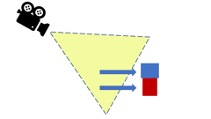

# COMP2160 Game Development – Prac Week 11
## Topics covered:
* Camera Tracking
* Camera Rotation and Manipulation

## Discussion Question
No discussion question today. Work on your pracs!

## Today's Task
In this prac you will be creating a tracking camera for an avatar in a 3D scene.
The framework implements an avatar that can be moved using WASD, and space to jump.


Your task will be to implement a tracking camera that follows the player, with the following controls:
* <b>Mouse Left-Click and Drag:</b> Rotate the camera around the player horizontally.
* <b> Mouse Wheel:</b> Zoom the camera in and out.

A camera with a pivot point has already been set-up, but it doesn’t interact with the player at all. A sample solution showing one possible implementation is playable here: https://uncanny-machines.itch.io/comp2160-camera-prac. 

Depending on how you write/modify the code, and the camera movement you want to accomplish, you may use different techniques to the sample solution. Let us know if you figure out something cool!

## Step 1 – A simple tracking camera
Following the example given in lectures, implement a simple tracking camera that keeps the player in the middle of the screen, as shown: 


The camera should maintain a constant orientation in world space.
 
### Checkpoint! Save, commit and push your work now

## Step 2 – Natural camera movement
Generally speaking, having a camera follow the player precisely can be a bit jarring. We may want the camera to behave slightly differently to give the game a more organic feel. In the sample solution, the camera follows the player with a slight delay using Vector3.Lerp, as shown:
  



When using Lerp, we want to set the camera’s new position as a weighted average of its old position and where the player is. We can do this by placing this code in ```FixedUpdate()```:

```
Vector3 offset = Vector3.Lerp(transform.position, player.position, moveSpeed);
```
Where ```moveSpeed``` is a factor between 0 and 1.

Try implementing a slight delay on your camera – does this achieve the kind of results you want? How could you alter your approach to get something smoother? Could you use a rigidbody instead of transform?

## Checkpoint! Save, commit and push your work now
## To receive half marks for today, show your tutor:
* Your delayed tracking camera, and how you achieved it.

## Step 3 – Camera zoom
Sometimes the player will want to get a better look at their surroundings, or zoom in on their character. Let’s assign a zoom function to the mouse wheel using the Mouse ScrollWheel input axis. We have a choice to make:

Do we want to dolly the camera by manipulating its position?


...Or do we want the camera to zoom, by manipulating its field-of-view?


There is no wrong answer here. Generally speaking, most games will change the position of the camera, as modifying the Field of View can look unnatural. Find what works best for you.

## Checkpoint! Save, commit and push your work now

## Step 4 – Camera rotation
Something else the player might like to do is rotate the camera around the player. Typically, rotation can occur both horizontally and vertically. For today, let’s just focus on horizontal rotation.

We want to make it so the player can rotate the camera around the player horizontally when they move the mouse left-and-right. Because we don’t want the player to do this accidentally, we’re going to make it so they have to hold-down left-click to achieve this:


## Step 5 – Camera feel
Once you’ve implemented all these steps, try playing around with the values and techniques. Does the camera movement feel natural? Is it too fast/slow? Identify and try to fix any problems you find.

## Prac complete! Save, commit and push your work now

## To receive full marks for today, show your tutor:
* Your zoom camera controls (did you change position or Field of View? Why?)
* Your camera rotation.
* Any modifications you made to achieve your desired camera.


